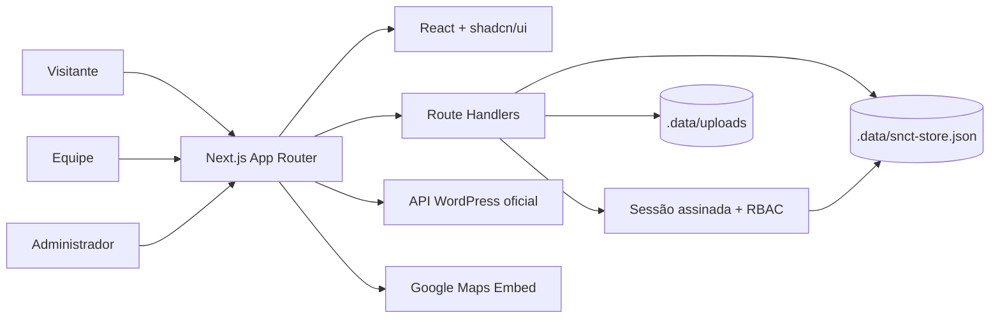

<div align="center">
  

# SNCT Paulista 2026

**Portal da Semana Nacional de Ciência e Tecnologia do Paulista — ciência, inovação e comunidade em uma experiência digital acessível.**

[](https://nextjs.org/)
[](https://react.dev/)
[](https://www.typescriptlang.org/)
[](https://tailwindcss.com/)
</div>


## Sobre o projeto

O SNCT Paulista 2026 reúne a presença pública do evento e sua operação em uma única aplicação. O portal apresenta notícias oficiais, programação, editais, parceiros e localização; visitantes podem se cadastrar e receber uma credencial por QR Code; equipes credenciadas fazem check-in e registram a entrega de brindes; administradores mantêm o conteúdo sem editar código.

## Principais recursos

- Portal público responsivo com hero animada, notícias, editais, agenda, mapa, parceiros e perguntas frequentes.
- Notícias obtidas em tempo real pela API WordPress oficial da [Prefeitura do Paulista](https://paulista.pe.gov.br/).
- Cadastro e autenticação com perfis de visitante, equipe e administrador.
- Credencial digital individual com QR Code.
- Leitura de QR Code para check-in e controle de entrega de brindes.
- Painel no-code para gerenciar usuários, programação, editais, anexos, parceiros e conteúdo da hero.
- Upload protegido de PDF, DOC, DOCX, ODT, XLS e XLSX, limitado a 10 MB por arquivo.
- Navegação mobile em menu lateral, foco visível, contraste reforçado e respeito a `prefers-reduced-motion`.

### Responsivo por padrão

<p align="center">
  
</p>

## Arquitetura



A aplicação usa componentes de servidor para compor páginas e buscar dados, componentes de cliente nas experiências interativas e Route Handlers como fronteira entre a interface e os dados administrativos. Consulte a [documentação de arquitetura](docs/architecture.md) para fluxos, modelo de dados, segurança e orientações de implantação.

## Perfis e jornadas

| Perfil        | Jornada principal                                                     |
| ------------- | --------------------------------------------------------------------- |
| Público       | Consulta notícias, programação, editais, parceiros, localização e FAQ |
| Visitante     | Cria conta, entra no portal e apresenta sua credencial em QR Code     |
| Equipe        | Lê a credencial, confirma check-in e registra a entrega do brinde     |
| Administrador | Gerencia pessoas, programação, editais, documentos, parceiros e hero  |

## Stack

- **Aplicação:** Next.js 16, React 19 e TypeScript.
- **Interface:** Tailwind CSS 4, shadcn/ui, Base UI e Lucide React.
- **Movimento:** Motion e Paper Design Shaders.
- **Formulários e experiência:** Sonner, React Day Picker, Embla Carousel e QR Scanner.
- **Qualidade:** ESLint, Prettier, TypeScript e Vitest.
- **Persistência atual:** JSON e arquivos no filesystem local, com escrita serializada e atômica.

## Estrutura do repositório

```text
src/
├── app/                 # Páginas, layouts e Route Handlers
│   ├── api/             # Autenticação, administração, staff e documentos
│   ├── cadastro/        # Cadastro público
│   ├── editais/         # Editais e anexos
│   ├── login/           # Entrada por perfil
│   └── perfil/          # Painéis de visitante, equipe e administrador
├── components/
│   ├── auth/            # Formulários e moldura de autenticação
│   ├── dashboard/       # Painel no-code, scanner e credencial
│   ├── event/           # Hero, notícias, destaques, parceiros e rodapé
│   └── ui/              # Primitivas reutilizáveis do design system
├── config/              # Conteúdo inicial e configurações públicas
└── lib/                 # Auth, integração de notícias, store e tipos

docs/                    # Arquitetura, operação e design system
public/                  # Imagens públicas e logotipo
.data/                   # Dados e uploads locais (ignorado pelo Git)
```

## Executando localmente

Requisitos: Node.js 20.9 ou superior e npm.

```powershell
git clone https://github.com/diegocoodes/snct.git
Set-Location snct
npm install
Copy-Item .env.example .env.local
npm run dev
```

Acesse `http://localhost:3000`.

### Variáveis de ambiente

| Variável              | Obrigatória | Finalidade                                                           |
| --------------------- | ----------- | -------------------------------------------------------------------- |
| `SNCT_SESSION_SECRET` | Sim         | Assina e valida o cookie de sessão; use um segredo longo e aleatório |
| `SNCT_ADMIN_EMAIL`    | Sim         | Identificador da conta administrativa inicial                        |
| `SNCT_ADMIN_PASSWORD` | Sim         | Senha da conta administrativa inicial                                |

Nunca versionar `.env.local`, credenciais ou o diretório `.data`. Para desenvolvimento com o MCP do 21st.dev, mantenha `API_KEY_21ST` apenas no ambiente do usuário; ela não é uma variável de execução da aplicação.

## Comandos disponíveis

```powershell
npm run dev          # servidor de desenvolvimento
npm run build        # build otimizado de produção
npm run start        # executa o build de produção
npm run lint         # análise estática
npm run typecheck    # validação de tipos
npm run test:run     # testes automatizados
npm run format       # formatação automática
npm run format:check # conferência de formatação
```

## Persistência e produção

No ambiente atual, usuários e conteúdo administrativo ficam em `.data/snct-store.json`; anexos ficam em `.data/uploads`. Essa estratégia facilita demonstração e desenvolvimento em um único servidor, mas **não é apropriada para plataformas serverless ou múltiplas instâncias**, onde o filesystem pode ser efêmero.

Antes de publicar em produção, migre o store para um banco persistente e os anexos para object storage. Mantenha as verificações de perfil no servidor, configure HTTPS, faça backup dos dados e use segredos exclusivos do ambiente.

## Documentação

- [Arquitetura e fluxos técnicos](docs/architecture.md)
- [Guia do painel administrativo](docs/administration.md)
- [Design system e acessibilidade](docs/design-system.md)

---

<div align="center">
  Desenvolvido para a Semana Nacional de Ciência e Tecnologia do Paulista 2026.
</div>
