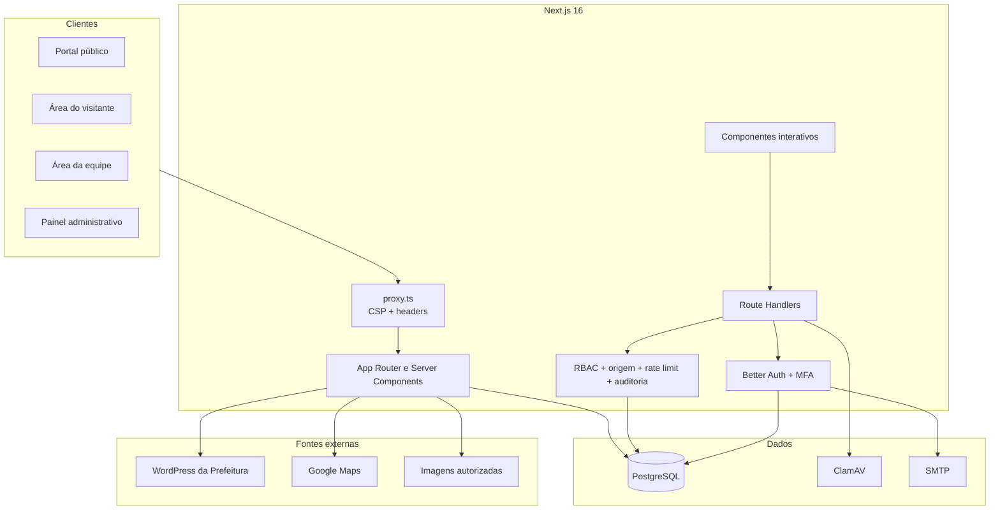
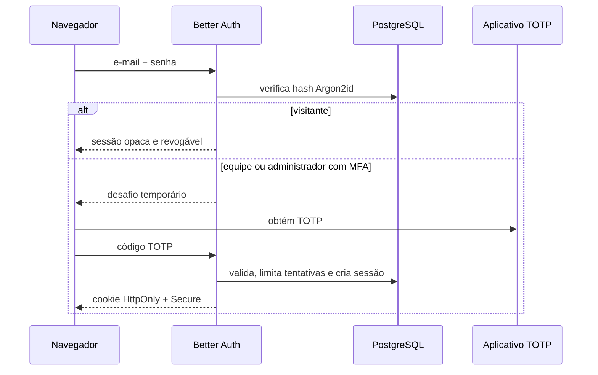
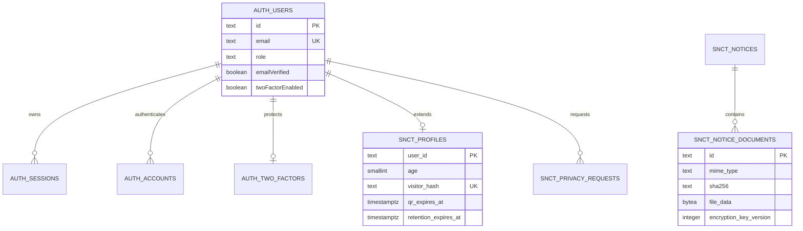

# Arquitetura do sistema

## Visão geral

O SNCT Paulista 2026 é um monólito modular em Next.js 16. Uma implantação entrega portal público, áreas autenticadas e endpoints internos. PostgreSQL é a fonte de verdade para autenticação, sessões, conteúdo, credenciais, arquivos, auditoria e controles de segurança.

## Camadas

- `src/app`: páginas, metadata e Route Handlers.
- `src/components`: experiência pública, autenticação, dashboards e primitivas.
- `src/lib/auth.ts`: Better Auth, Argon2id, MFA, sessões e políticas de e-mail.
- `src/lib/db.ts`: pool PostgreSQL e transações.
- `src/lib/request-security.ts`: origem, cabeçalho anti-CSRF e rate limiting.
- `src/lib/snct-store.ts`: repositório de conteúdo, credenciais e documentos.
- `src/lib/audit.ts`: trilha de eventos sensíveis.
- `src/lib/encryption.ts`: criptografia versionada AES-256-GCM.
- `src/proxy.ts`: nonce CSP e headers de proteção.
- `db/migrations`: esquema SQL imutável e versionado.

## Autenticação e autorização

Contas privilegiadas sem MFA ativo recebem uma sessão limitada apenas à tela de inscrição do autenticador. APIs de equipe e administração chamam `requireRole`, que exige perfil correto e MFA habilitado.

## Esquema de dados

As tabelas `auth_*` pertencem à autenticação: usuários, contas, sessões, verificações, MFA e rate limits. As tabelas `snct_*` contêm perfis do evento, programação, editais, anexos, parceiros, configurações, auditoria e solicitações de privacidade.

## Rotas internas

| Rota                  | Acesso              | Responsabilidade                                    |
| --------------------- | ------------------- | --------------------------------------------------- |
| `/api/auth/[...all]`  | Público/autenticado | MFA, verificação, recuperação e sessões Better Auth |
| `/api/auth/register`  | Público             | Validação SNCT, consentimento e criação de perfil   |
| `/api/auth/login`     | Público             | Bootstrap controlado, login e auditoria             |
| `/api/account`        | Autenticado         | Exportação, exclusão e rotação do QR                |
| `/api/admin`          | Admin + MFA         | Conteúdo, usuários, anexos e configurações          |
| `/api/staff`          | Staff/Admin + MFA   | Check-in e entrega de brinde                        |
| `/api/documents/[id]` | Público             | Download de anexo limpo e descriptografado          |

Mutações próprias exigem origem autorizada, `Sec-Fetch-Site` aceitável e o cabeçalho não simples `X-SNCT-Request`. Better Auth aplica sua própria proteção CSRF e validação de origem.

## Arquivos

1. O servidor limita nome e tamanho a 10 MB.
2. `file-type` compara assinatura binária e extensão permitida.
3. ClamAV analisa o conteúdo em streaming.
4. SHA-256 identifica integridade e duplicidade operacional.
5. AES-256-GCM criptografa o binário com chave versionada.
6. O PostgreSQL armazena somente o conteúdo aprovado.
7. Downloads usam `attachment`, `nosniff` e CSP sandbox.

## Consistência

- Migrações são executadas em ordem com advisory lock e checksum.
- Alterações de conteúdo usam transações e advisory lock.
- Rate limits usam `INSERT ... ON CONFLICT` atômico.
- Check-in, brinde e QR são idempotentes.
- Exclusões de usuários propagam para sessões, contas, MFA e perfil.

## Integrações externas

- Notícias: chamada server-side, timeout de oito segundos, somente domínio oficial e sem cache persistente.
- Mapas: iframe restrito pela CSP.
- Imagens: HTTPS e allowlist de hosts.
- SMTP: apenas links transacionais de verificação, senha e exclusão.
- ClamAV: daemon privado; a aplicação falha de forma fechada em produção quando indisponível.
