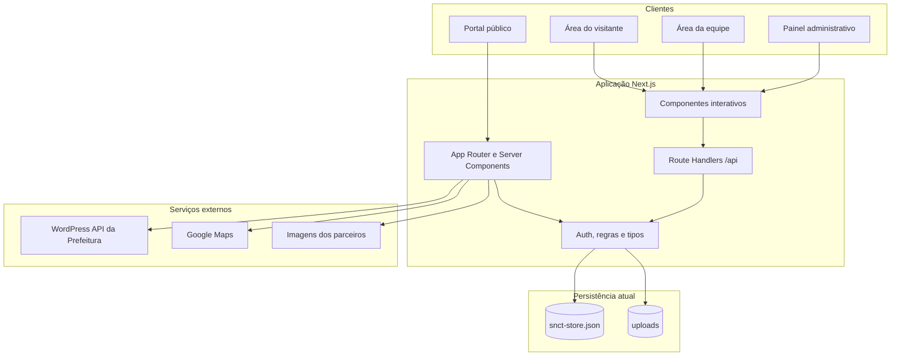
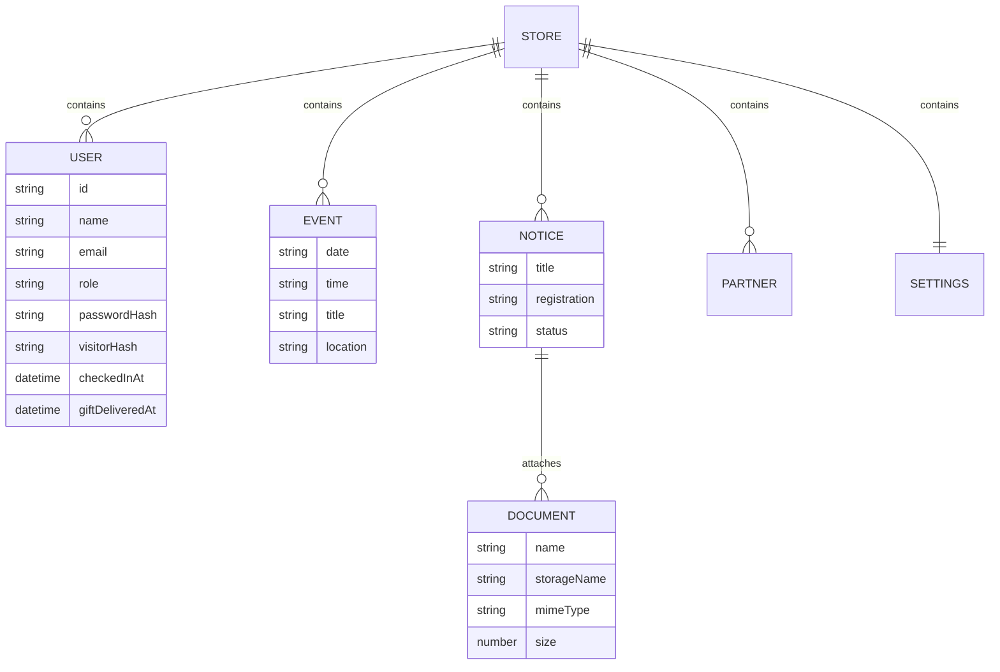

# Arquitetura do sistema

## Visão geral

O SNCT Paulista 2026 é uma aplicação monolítica modular em Next.js. A mesma implantação entrega o portal público, as áreas autenticadas e os endpoints internos. A separação entre componentes públicos, operações de domínio e infraestrutura reduz o acoplamento e deixa preparada a futura troca do armazenamento local por serviços persistentes.

## Camadas

### Apresentação

- `src/app`: rotas públicas, páginas autenticadas, metadata e estilos globais.
- `src/components/event`: seções do portal e navegação responsiva.
- `src/components/auth`: cadastro e login.
- `src/components/dashboard`: painéis por perfil, scanner e credencial.
- `src/components/ui`: primitivas compartilhadas do design system.

### Aplicação e domínio

- `src/lib/auth.ts`: hashing de senhas, sessão assinada, cookies e autorização por perfil.
- `src/lib/snct-types.ts`: contratos de usuários, conteúdo, documentos e sessão.
- `src/config`: valores iniciais e conteúdo público estático.

### Infraestrutura

- `src/lib/snct-store.ts`: leitura e gravação serializada do JSON, upload e remoção de anexos.
- `src/lib/paulista-news.ts`: integração somente leitura com a API oficial de notícias.
- `src/app/api`: fronteira HTTP para autenticação, administração, staff e documentos.

## Rotas e responsabilidades

| Rota                  | Métodos                | Acesso                  | Responsabilidade                                                 |
| --------------------- | ---------------------- | ----------------------- | ---------------------------------------------------------------- |
| `/api/auth/register`  | `POST`                 | Público                 | Cria visitante, gera identificador da credencial e inicia sessão |
| `/api/auth/login`     | `POST`                 | Público                 | Autentica pelo perfil solicitado e inicia sessão                 |
| `/api/auth/logout`    | `POST`                 | Autenticado             | Encerra a sessão atual                                           |
| `/api/admin`          | `GET`, `POST`, `PATCH` | Administrador           | Consulta e altera dados do portal, usuários e anexos             |
| `/api/staff`          | `POST`                 | Equipe ou administrador | Processa QR Code, check-in e entrega de brinde                   |
| `/api/documents/[id]` | `GET`                  | Público                 | Entrega um anexo cadastrado por identificador conhecido          |

## Modelo de dados

## Fluxos principais

### Cadastro e credencial

1. O visitante informa nome, e-mail, idade e senha.
2. O servidor valida os dados, aplica `scrypt` à senha e cria um hash individual para a credencial.
3. Uma sessão de oito horas é assinada e gravada em cookie `HttpOnly`.
4. A área do visitante transforma o identificador em QR Code sem expor a senha.

### Check-in e brinde

1. A equipe autenticada lê o QR Code pela câmera ou informa o valor manualmente.
2. O endpoint de staff normaliza o token e encontra o visitante correspondente.
3. O primeiro check-in registra data e hora; chamadas repetidas são idempotentes.
4. O brinde só pode ser registrado depois do check-in e também é idempotente.

### Gestão de editais

1. O administrador cria ou edita o edital pelo painel.
2. O servidor valida metadados, extensão e limite de 10 MB do anexo.
3. Os metadados entram no store e o binário é salvo com nome aleatório.
4. A página pública apresenta os documentos pelo endpoint de download.

### Notícias oficiais

1. O servidor consulta `https://paulista.pe.gov.br/wp-json/wp/v2/posts` sem cache persistente.
2. Apenas links e imagens do domínio oficial são aceitos.
3. HTML e entidades são normalizados antes da renderização.
4. Falhas externas retornam uma lista vazia e não impedem o restante da página.

## Segurança

- Senhas de visitantes e equipe são derivadas com `scrypt` e salt aleatório.
- Sessões usam HMAC SHA-256, cookie `HttpOnly`, `SameSite=Lax` e `Secure` em produção.
- Toda operação administrativa ou de staff repete a autorização no servidor.
- O e-mail administrativo é reservado e não pode ser registrado como visitante.
- Nomes de arquivos armazenados são gerados pelo servidor; downloads validam o identificador.
- `.env*` e `.data` são ignorados pelo Git.

O projeto não substitui uma revisão de segurança antes da operação pública. Em produção, recomenda-se ainda rate limiting, trilha de auditoria, proteção específica contra abuso, política de retenção e revisão LGPD.

## Estratégia de implantação

A persistência atual pressupõe uma única instância com disco gravável e durável. Para produção escalável:

1. Substitua `snct-store.ts` por um repositório conectado a PostgreSQL ou serviço equivalente.
2. Armazene anexos em object storage e sirva downloads com URLs assinadas quando necessário.
3. Execute migrations e backups automatizados.
4. Injete os três segredos `SNCT_*` pelo provedor, nunca pelo repositório.
5. Mantenha a aplicação atrás de HTTPS e configure observabilidade, alertas e logs sem dados sensíveis.

Como a UI chama apenas os Route Handlers e contratos de domínio, a migração de persistência pode ser feita sem reescrever as páginas.
